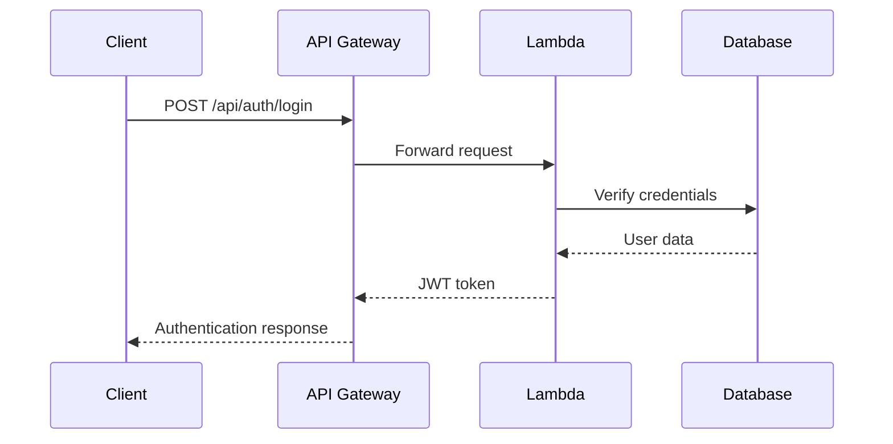
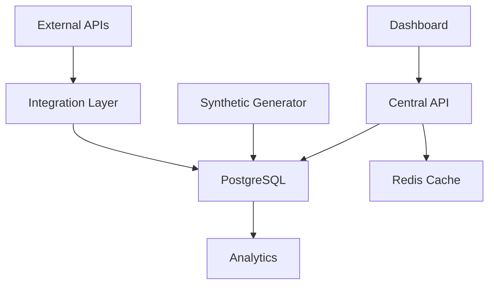

# Auxeira Central Database System

A comprehensive central database solution for managing timestamped synthetic data across 7 specialized dashboards for the Auxeira Startup Success Engine (SSE) platform.

## 🏗️ Architecture Overview

The central database system is built using a serverless architecture on AWS, providing:

- **PostgreSQL Database**: Aurora PostgreSQL for structured data with ACID compliance
- **Redis Cache**: ElastiCache for real-time data and session management
- **Lambda Functions**: Serverless API endpoints and background processing
- **API Gateway**: RESTful API with authentication and rate limiting
- **CloudWatch**: Monitoring, logging, and alerting

## 📋 Features

### Core Functionality
- ✅ **Timestamped Data Management**: All data entries include creation and update timestamps
- ✅ **Multi-tenant Support**: Supports all 7 user types (Startup Founder, VC, Angel Investor, etc.)
- ✅ **Synthetic Data Generation**: Realistic synthetic data with configurable patterns and trends
- ✅ **Data Versioning**: Track changes over time with complete audit trails
- ✅ **Real-time APIs**: RESTful endpoints for all dashboard operations
- ✅ **Authentication**: JWT-based authentication with refresh tokens
- ✅ **Gamification**: Token-based reward system with multipliers and streaks

### Dashboard Support
- 🎯 **Startup Founder Dashboard**: SSE scoring, metrics tracking, gamification
- 💼 **Venture Capital Dashboard**: Portfolio monitoring, deal flow, market intelligence
- 👼 **Angel Investor Dashboard**: Investment tracking, due diligence, network building
- 🏢 **Corporate Partner Dashboard**: Partnership management, benefit distribution
- 🏛️ **Government Dashboard**: Ecosystem monitoring, compliance tracking
- 🌱 **ESG Funder Dashboard**: Sustainability metrics, ESG scoring
- 💚 **Impact Investor Dashboard**: Social ROI measurement, impact analytics

## 🚀 Quick Start

### Prerequisites

- AWS CLI configured with appropriate permissions
- Node.js 18+ and npm
- Python 3.11+
- Serverless Framework

### Installation

1. **Clone and setup the project:**
```bash
git clone <repository-url>
cd auxeira-central-db
```

2. **Install dependencies:**
```bash
npm install
pip install -r requirements.txt
```

3. **Configure AWS credentials:**
```bash
aws configure --profile auxeira
```

4. **Deploy to AWS:**
```bash
./deploy.sh prod us-east-1 auxeira
```

### Environment Variables

Set these in AWS Parameter Store:

```bash
# Database credentials
aws ssm put-parameter --name "/auxeira/database/username" --value "auxeira_admin" --type "String"
aws ssm put-parameter --name "/auxeira/database/password" --value "your-secure-password" --type "SecureString"

# API secret key
aws ssm put-parameter --name "/auxeira/api/secret-key" --value "your-jwt-secret" --type "SecureString"
```

## 📊 Database Schema

### Core Tables

#### Users and Organizations
- `users` - User accounts with authentication
- `organizations` - Companies, funds, government entities
- `user_organizations` - Many-to-many relationships

#### SSE Scoring System
- `sse_scores` - Startup Success Engine scores with versioning
- `sse_score_history` - Change tracking and audit trail

#### Data Integration
- `integrations` - External service connections (Stripe, QuickBooks, etc.)
- `integration_data` - Timestamped data from external sources

#### Gamification
- `actions` - User actions and token rewards
- `gamification_profiles` - User progress and achievements

#### Analytics
- `dashboard_metrics` - Timestamped metrics for all dashboard types
- `synthetic_data_templates` - Templates for data generation
- `synthetic_data_sessions` - Generation sessions and parameters

## 🔌 API Endpoints

### Authentication
```http
POST /api/auth/register
POST /api/auth/login
```

### Dashboard Data
```http
GET  /api/dashboard/metrics?type=startup_founder&days=30
POST /api/dashboard/metrics
```

### Synthetic Data
```http
POST /api/synthetic/generate
GET  /api/synthetic/templates
```

### SSE Scoring
```http
POST /api/sse/calculate
GET  /api/sse/score/:startupId
```

### Gamification
```http
POST /api/gamification/action
GET  /api/gamification/profile
```

### Health & Admin
```http
GET  /api/health
GET  /api/admin/stats
POST /api/admin/cleanup
```

## 🎮 Dashboard Integration

### JavaScript Client Library

Include the client library in your dashboard:

```html
<script src="auxeira-central-client.js"></script>
```

### Basic Usage

```javascript
// Initialize client
const auxeiraClient = new AuxeiraCentralClient({
    apiEndpoint: 'https://api-central.auxeira.com',
    debug: true
});

// Login
await auxeiraClient.login('user@example.com', 'password');

// Get dashboard data
const dashboardData = await auxeiraClient.initializeDashboard();

// Generate synthetic data
await auxeiraClient.generateSyntheticData({
    count: 50,
    trend: 'improving'
});

// Start real-time updates
auxeiraClient.startPeriodicUpdates((data) => {
    updateDashboardUI(data);
});
```

### Integration Example

For detailed integration examples, see:
- `integration/startup-founder-integration.js` - Complete startup founder dashboard integration
- `integration/auxeira-central-client.js` - Full client library documentation

## 🔧 Configuration

### Serverless Configuration

The `serverless.yml` file contains all infrastructure configuration:

- **Database**: Aurora PostgreSQL cluster with read replicas
- **Cache**: ElastiCache Redis cluster
- **Functions**: Lambda functions for API and background processing
- **Monitoring**: CloudWatch dashboards and alarms
- **Security**: VPC, security groups, and IAM roles

### Environment-Specific Settings

```yaml
# Production
stage: prod
database: auxeira-central-db-prod
redis: auxeira-central-redis-prod

# Development  
stage: dev
database: auxeira-central-db-dev
redis: auxeira-central-redis-dev
```

## 📈 Synthetic Data Generation

### Data Types Supported

- **Startup Founder**: SSE scores, revenue, customers, team size, burn rate
- **Venture Capital**: Portfolio size, AUM, deal flow, exits
- **Angel Investor**: Investment count, total invested, IRR
- **Corporate Partner**: Active partnerships, ROI, pilot programs
- **Government**: Startups monitored, grants, economic impact
- **ESG Funder**: ESG scores, carbon reduction, sustainability metrics
- **Impact Investor**: Social ROI, lives impacted, SDG alignment

### Generation Parameters

```python
config = SyntheticDataConfig(
    user_type='startup_founder',
    data_type='metrics',
    count=30,                    # Number of data points
    time_range_days=30,         # Time span
    variance=0.2,               # Data variance (0.0-1.0)
    trend='improving',          # 'improving', 'declining', 'stable', 'volatile'
    seed=42                     # For reproducible results
)
```

## 🔍 Monitoring and Observability

### CloudWatch Metrics

- Lambda function duration, errors, and invocations
- RDS CPU utilization and connections
- ElastiCache hit rates and memory usage
- API Gateway request counts and latency

### Health Checks

The system includes comprehensive health checks:

```bash
curl https://api-central.auxeira.com/health
```

Returns:
- Database connectivity status
- Data volume checks
- Recent activity monitoring
- Synthetic data generation status

### Logging

All components log to CloudWatch with structured logging:

- API requests and responses
- Database operations
- Synthetic data generation
- Error tracking and debugging

## 🛠️ Development

### Local Development

1. **Set up local database:**
```bash
docker run -d --name auxeira-postgres \
  -e POSTGRES_DB=auxeira_central \
  -e POSTGRES_USER=postgres \
  -e POSTGRES_PASSWORD=postgres \
  -p 5432:5432 postgres:15
```

2. **Initialize schema:**
```bash
python utils/database_manager.py
```

3. **Run API locally:**
```bash
export DB_HOST=localhost
export DB_NAME=auxeira_central
export DB_USER=postgres
export DB_PASSWORD=postgres
python api/main.py
```

### Testing

```bash
# Run unit tests
pytest tests/

# Run integration tests
pytest tests/integration/

# Generate test data
python utils/synthetic_data_generator.py
```

## 📦 Deployment

### Production Deployment

```bash
# Deploy to production
./deploy.sh prod us-east-1 auxeira

# Deploy to development
./deploy.sh dev us-east-1 auxeira
```

### Deployment Verification

After deployment, verify:

1. **Health check passes:**
```bash
curl https://api-central.auxeira.com/health
```

2. **Database initialized:**
```bash
aws lambda invoke --function-name auxeira-central-database-prod-initDatabase
```

3. **Synthetic data generation works:**
```bash
aws lambda invoke --function-name auxeira-central-database-prod-generateSyntheticData
```

## 🔒 Security

### Authentication
- JWT tokens with configurable expiration
- Refresh token mechanism
- Row-level security (RLS) on sensitive tables

### Data Protection
- All data encrypted at rest and in transit
- Database credentials stored in AWS Parameter Store
- VPC isolation for database and cache

### Access Control
- IAM roles with least privilege principle
- API rate limiting and throttling
- CORS configuration for web dashboards

## 📚 API Documentation

### Authentication Flow



### Data Flow



## 🤝 Contributing

1. Fork the repository
2. Create a feature branch
3. Make your changes
4. Add tests
5. Submit a pull request

## 📄 License

This project is proprietary to Auxeira. All rights reserved.

## 🆘 Support

For support and questions:

- **Documentation**: Check this README and inline code comments
- **Issues**: Create GitHub issues for bugs and feature requests
- **Contact**: support@auxeira.com

## 🔄 Changelog

### Version 1.0.0 (2025-01-04)
- Initial release
- Complete database schema implementation
- All 7 dashboard types supported
- Synthetic data generation
- AWS serverless deployment
- JavaScript client library
- Comprehensive monitoring and health checks

---

**Built with ❤️ for the Auxeira Startup Success Engine platform**
